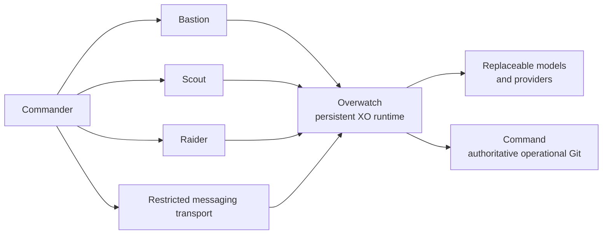

<p align="center">
  
</p>

# WolfPack

WolfPack is a personal, multi-machine AI and automation environment built around one durable supervisory assistant identity—**XO**—rather than around a particular model, provider, interface, session, or computer. It explores how a human can delegate bounded technical and real-world missions to an AI operating environment while retaining authority, preserving meaningful state, separating privileges, and requiring observable evidence for consequential actions.

> **Minimal mechanism. Explicit context. Observable outcomes.**

## Why this project exists

Most AI assistants are experienced as disposable chat sessions. Useful engineering work, however, spans machines, interfaces, tools, changing models, interruptions, security boundaries, and decisions that must remain inspectable later.

WolfPack explores a different operating model:

```text
discuss → decide → authorize objective and boundaries → execute → verify → report evidence
```

The goal is not unrestricted autonomy. The goal is a practical environment in which routine, approved work can be completed without turning the human operator into a keyboard peripheral, while ambiguous, destructive, security-sensitive, or identity-changing decisions return to the human.

## One XO, many windows

**XO** is the persistent supervisory role in WolfPack. XO is conceptually separate from:

- the model performing an inference;
- the provider serving that model;
- the Pi agent harness currently hosting the interaction;
- the runtime machine;
- a terminal, browser, Telegram conversation, or other interface;
- an individual context window or session.

Authorized devices and transports are windows into the same XO:

> **One XO, many windows.**

Changing windows should not create a second assistant identity, duplicate authority, or discard the project's durable operating context.

## Human and XO responsibilities

WolfPack calls the human owner **Commander**. These labels describe an authority model, not a fictional organization.

**Commander:**

- defines desired outcomes and boundaries;
- retains authority over destructive, security-sensitive, identity, credential, recovery, financial, and scope-changing decisions;
- handles passwords, MFA, passkeys, CAPTCHA, and legal attestations directly;
- resolves genuinely ambiguous product or risk decisions.

**XO:**

- translates approved intent into bounded operational steps;
- checks current project context and live system facts;
- chooses the smallest sufficient mechanism;
- executes routine in-scope work where authority exists;
- verifies files, Git state, configuration, runtime behavior, and external outcomes observably;
- stops or escalates when authority, evidence, safety, or scope is insufficient;
- promotes important decisions and state out of volatile conversation context.

## Architecture at a glance

WolfPack assigns explicit conceptual roles to its machines:

| Role | Purpose |
|---|---|
| **Command** | Infrastructure and authoritative operational Git source |
| **Overwatch** | Persistent XO runtime and replaceable agent harness |
| **Bastion** | Trusted operator and administration workstation |
| **Scout** | Portable Commander and bounded reconnaissance client |
| **Raider** | Mobile Commander interface |

The names make trust and responsibility boundaries easy to discuss. Network reachability does not imply permission, and a working copy does not become authoritative merely because it is convenient.



See [Architecture](docs/architecture.md) for the boundaries behind this view.

## Evidence-based execution

WolfPack treats narration and execution as different things. A tool saying “done,” including an AI tool, does not prove that a file changed, a command ran, a repository was published, or an external transaction completed.

Meaningful work follows:

1. **Intent** — state the expected change.
2. **Action** — perform the bounded operation.
3. **Observable verification** — inspect the resulting state independently.
4. **Reconciliation** — update durable project context when the operational state materially changed.

The strength of verification is proportional to risk. A text extraction may need source checking; a repository publication needs ref and visibility checks; security and recovery work needs independent evidence and failure-path testing.

## Security and privilege philosophy

WolfPack uses practical privilege separation rather than assuming a single all-powerful agent account.

- Credentials and machine-local authentication state stay outside canonical repositories.
- External transports are treated as untrusted input boundaries.
- Authentication, MFA, CAPTCHA, and recovery operations remain human-controlled.
- Delegated identities receive the narrowest useful permissions.
- Browser operation is visible, bounded, and operator-started.
- High-impact changes require explicit authorization.
- Private operational details and recovery material are separated from public project documentation.
- Removal and recovery paths are part of component design.

See [Security model](docs/security-model.md).

## Models are cognitive resources

Models and providers are replaceable cognitive resources, not the identity of XO. Selection should eventually reflect task difficulty, risk, tool support, latency, quota, cost, privacy, and reversibility.

WolfPack does **not** currently operate a persistent multi-agent organization. A possible future direction is for XO to commission short-lived, tightly scoped cognitive workers for specific subtasks, then verify and integrate their results. That remains an architectural candidate, not an implemented production capability.

## Git-backed state

Operational project context, architecture, runbooks, selected implementation, and append-only historical checkpoints are maintained in Git. The local Command repository remains authoritative for operational WolfPack. A private GitHub repository provides an off-machine mirror, not a replacement authority.

This public repository has a separate root and independent history. It contains WolfPack's public architecture, engineering documentation, and—when deliberately selected—safe implementation material. Private operational configuration, credentials, recovery material, personal data, and sensitive infrastructure details are maintained separately.

## Current status

WolfPack is an active personal engineering project. Its first operational baseline is complete, including:

- a persistent XO runtime using stock Pi as the current replaceable harness;
- multiple workstation, mobile, and messaging windows into the same XO;
- an authoritative local Git source with independent recovery copies and a private off-machine mirror;
- restricted Git publication authority with observable ref verification;
- a privilege-separated messaging transport for correlated text and file interaction;
- an operator-started, visible browser-control path that leaves credentials and human-verification boundaries with Commander;
- recovery and continuity runbooks tested through disposable restoration;
- cross-interface continuity exercised through bounded real-world workflows.

These results demonstrate an operating foundation, not a finished general-purpose autonomous system.

## Current limitations

- XO still depends on the availability of its current runtime and harness, even though both are intended to be replaceable.
- Durable memory requirements are not fully resolved; Git-backed context is deliberate state, not a complete memory system.
- Cognitive worker delegation and automatic model routing are design directions, not implemented WolfPack components.
- Browser capability is intentionally narrow and operator-started, not unattended web automation.
- Public implementation material is being curated from first principles rather than copied from the private operational repository.
- WolfPack is a personal project and does not claim production, enterprise, or safety-critical readiness.

## Documentation

- [Architecture](docs/architecture.md)
- [Design principles](docs/design-principles.md)
- [Operating model](docs/operating-model.md)
- [Security model](docs/security-model.md)
- [Roadmap](docs/roadmap.md)
- [Security reporting](SECURITY.md)

## License

No open-source license has been selected. Copyright remains with the repository owner; absence of a license does not grant permission for unrestricted reuse, modification, or redistribution.
