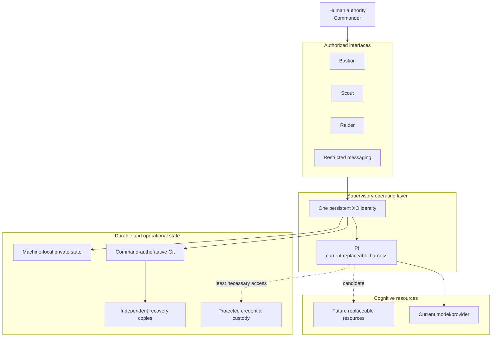

# Architecture

WolfPack separates identity, cognition, runtime, interfaces, durable state, and authority. The objective is continuity without concentrating every capability into one account or service.

## Logical layers

The diagram is conceptual. Public documentation deliberately omits addresses, account names, access-control internals, key material, and recovery details.

## Machine roles

### Command

Command is the infrastructure and operational Git authority. Its repository is the source of truth for private operational WolfPack state. Publishing a mirror elsewhere does not silently transfer that authority.

### Overwatch

Overwatch hosts the long-lived XO environment and current Pi harness. It has a non-authoritative working copy and narrowly delegated abilities required for approved work. It is a separate trust boundary from Command.

### Bastion

Bastion is the trusted human-operated workstation for administration and interactive work. Normal XO access and deliberate administration use distinct identities and authority paths.

### Scout

Scout is a portable client for the same XO and can provide bounded, operator-started reconnaissance. It is not a second XO runtime and does not receive broad unattended administration rights.

### Raider

Raider is a mobile interface for conversation, notifications, and other phone-appropriate interaction. It is not treated as a general-purpose server.

## Identity versus implementation

XO is a supervisory identity and operating role. It is not equivalent to:

- Pi;
- a model or model version;
- a provider account;
- Overwatch;
- a terminal or messaging thread;
- a process ID;
- a context window.

This separation makes replacement and recovery designable. The practical implementation is not perfectly independent yet, but the architecture avoids making incidental runtime choices into permanent identity.

## Repository model

WolfPack uses three distinct repository purposes:

1. **Operational authority** — private, locally controlled, and authoritative.
2. **Private off-machine mirror** — a recovery copy of intended refs; non-authoritative.
3. **Public representation** — independently initialized and deliberately curated, with no shared operational ancestry.

This prevents publication from becoming a sanitization exercise over sensitive history.

## State classes

- **Public project state:** architecture, design rationale, safe examples, limitations, and roadmap.
- **Private operational state:** detailed configuration, internal runbooks, and ordinary private project records.
- **Local-only protected state:** credentials, session databases, cookies, private keys, and machine-specific authentication material.

The classification is based on consequence, not convenience. `.gitignore` is not a security boundary.

## Data and control flow

Interfaces carry Commander intent to XO. XO checks durable context and live facts, invokes permitted tools, and returns verified outcomes. External transports validate and constrain inputs before they reach the supervisory environment. Credentials remain in narrower custody than the general XO process wherever practical.

No network connection, transport, or cloned repository grants authority by itself.

## Deliberate non-components

WolfPack currently avoids introducing infrastructure without demonstrated need, including:

- a persistent multi-agent hierarchy;
- a message bus;
- a vector database by default;
- an orchestration platform;
- a monitoring stack for appearances;
- a public control plane;
- a custom harness where Pi already provides a sufficient primitive.

A component must justify ownership, continuous operation, data custody, permissions, recovery, cost, verification, Commander-workload reduction, and removal pain.
