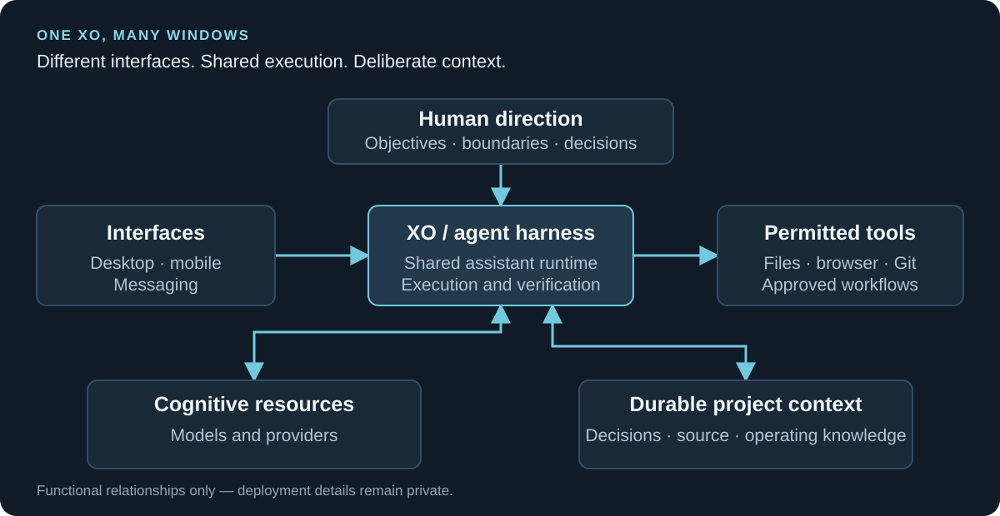

# Architecture

WolfPack separates human direction, assistant execution, cognitive resources, interfaces, and durable state. The aim is to make useful delegation possible without turning every connected component into an equally privileged part of the system.

## Functional roles

| Role | Responsibility |
|---|---|
| **Operator environment** | Deliberate administration, approval, and recovery work |
| **Desktop and portable clients** | Access to the shared assistant and bounded interactive workflows |
| **Mobile interface** | Conversation, files, notifications, and phone-appropriate interaction |
| **Assistant runtime** | The shared XO environment and current agent harness |
| **Infrastructure host** | Hosting and the authoritative private operational Git source |

These roles explain the design. Public documentation does not map them to machine names, addresses, accounts, or access rules.

## XO, harness, and cognition

**XO** is the supervisory operating role. **Pi** is the current agent harness. Models and providers supply cognition.

Keeping those concepts distinct allows a model or interface to change without redefining the assistant's responsibilities or making it the new owner of project knowledge. The runtime is still a real dependency; separating concepts makes replacement and recovery designable rather than automatic.

## Interfaces and execution

Desktop, portable, mobile, and messaging interfaces connect to the shared runtime. They carry intent and return results; they do not create separate assistants or independently grant new authority.

The Telegram integration separates transport from assistant execution. Browser interaction uses a dedicated, visible, operator-started environment. Authentication and personal attestations remain direct human actions.

This is a responsibility model, not a network diagram. Authority is attached to the approved work and the identities performing it, not inferred from connectivity.

## Durable state

Different state needs different treatment:

- **Project context:** architecture, decisions, runbooks, source, and selected verified state, maintained in Git.
- **Private work records:** personal or operational material kept outside the public project.
- **Runtime history:** useful supporting context, not the sole definition of XO or its memory.
- **Credentials and authentication:** protected machine-local custody, separate from repository content.

Useful context is promoted deliberately. Saving every conversation indiscriminately is not the same as having a useful memory system.

## Repository responsibilities

The private, locally controlled operational repository is authoritative. Its private GitHub mirror is an off-machine recovery copy, not a second source of truth.

This public repository has an independent history. It holds deliberately authored architecture, case studies, and selected technical material rather than an exported operational deployment.

Standard Git bundles and mirrors support repository recovery. Runtime reconstruction has its own configuration and reauthentication requirements; repository restoration alone does not recreate the running system.

## Native systems and future integration

The Household use case uses Home Assistant for deterministic state and scheduling. The intended future XO interface would interpret and coordinate approved requests while leaving those mechanics with the native platform.

The same architectural question applies elsewhere: which part needs cognition, which part needs deterministic execution, and which existing component already owns the capability?

## Keeping the system small

WolfPack does not use a persistent hierarchy of named agents. Temporary cognitive workers remain a candidate for narrowly scoped tasks.

A new component must justify the problem it solves, the state and permissions it owns, its operating cost, its recovery path, and how it can be removed. See [Design principles](design-principles.md).
